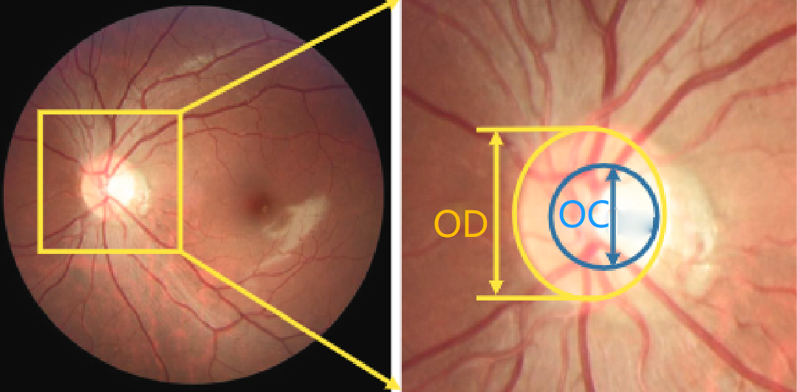

# Exercise UNet

### problem
I am trying to test my model with different batch sizes and I am getting different accuracies for different batch sizes. 

The model has been roughly trained https://share.weiyun.com/ZhShMt5U. Modify the patchsize in test.py to test


### structure
* data：The drishti data set contains 101 images and masks，all here, no more downloads.
* dataset.py：pytorch Dataset, and albumentations
* metrics.py：evaluating indicator like dice iou...
* net.py：unet
* process.py：Training function and verification function
* test.py：Training entrance
* train.py：Test entrance

### Environment
* pytorch 1.11 (reference)
* torchvision
* numpy
* torch
* tqdm
* albumentations

### Dataset introduce
Try to separate OC and OD from fundus image


### run
```
cd  unet

pip install -r requirements.txt

python train.py

python test.py
```